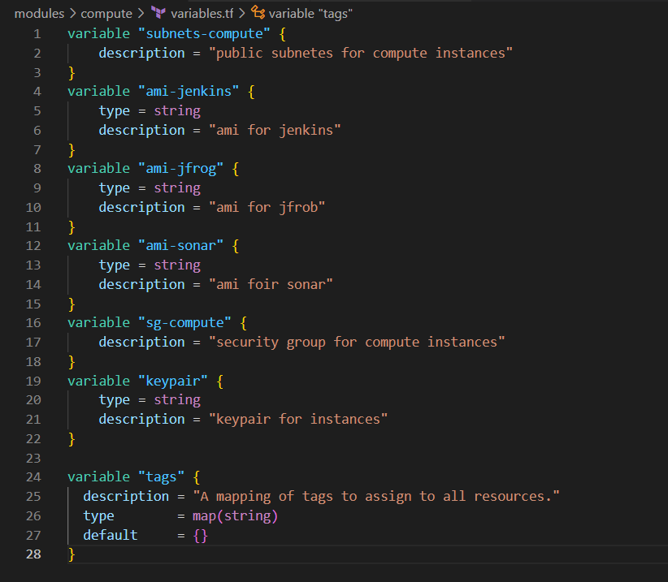

### terraform modules

- created a modules directory and populated it with the cloud infrastructure directories and files
- added the cloud provider file to the root module

- set up alb directory
- populated it with main.tf, outputs.tf, etc files

- created vpc directory and followed the same process above

- added vpc and alb scripts to the root module file

- asg creation and population

- compute creation and population

- efs creation and population

- rds creation and population

- security creation and population

 - edited root modules file to include s3 bucket conf script

 - edited providers.tf file

 

 

  - ran the terraform init, fmt, validate, plan and apply commands

   

  

  

  

  